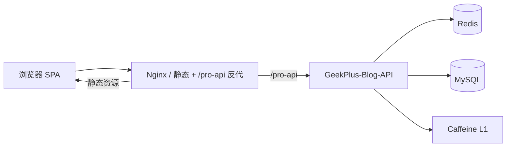

# 全栈技术架构与前后端协作

> 后端文档第 1 篇｜把「博客前台 + 管理后台」前端与本仓库 `GeekPlus-Blog-API` 放在一张图里讲清  
> 性质：架构与契约说明；实现以各仓库源码为准

---

## 一、系统定位

| 仓库 | 角色 |
|------|------|
| `geekplus-blog-frontend` | Vue 2 SPA：访客博客 + Element 管理端 |
| `GeekPlus-Blog-API` | Spring Boot API：JWT 会话、RBAC、内容、统计、文件等 |

产品形态是**一体站**：同一域名下前台浏览与后台运营共享账号体系，但**动态路由与菜单数据源分离**。



---

## 二、后端分层（扫描摘要）

### 2.1 技术基线

| 层 | 选型 |
|----|------|
| 运行时 | Spring Boot 2.x |
| 安全 | Apache Shiro + 自研 JWT（`jwt-plus`），**非** Spring Security（可插拔方案见第 9 篇） |
| 持久化 | MyBatis + MySQL |
| 缓存 | Redis；热点 RBAC/配置走 `TwoLevelCache`（Caffeine + Redis） |
| 其它 | WebSocket / Quartz / 文件与签名资源等 |

### 2.2 请求进入安全链

```text
HTTP
  → IpRateLimitFilter（可选）
  → DelegatingFilterProxy(shiroFilterFactoryBean)
       ├─ anon：登录、验证码、/geekplusapp/**、部分下载与 WS …
       ├─ signedAnon：/profile/** 等签名资源
       └─ jwt：其余路径 → JwtFilter → JwtRealm
            → SysUserTokenService（验 JWT + Redis LoginUser + 在线 JTI）
            → 授权时 RbacCacheService.resolvePerms
  → Controller（@RequiresPermissions / 业务）
```

关键类（后端）：

| 职责 | 类 |
|------|-----|
| Filter 链 | `framework.jwtshiro.ShiroConfig` / `JwtFilter` |
| Realm | `JwtRealm` |
| Token/会话 | `SysUserTokenService` / `JwtUtil` |
| 登录 | `SysUserLoginController` |
| RBAC 缓存 | `RbacCacheService` + `TwoLevelCache` |
| 数据权限 | `DataScopeAspect` + `@DataScope` + `DataScopeInterceptor`（AOP 算片段，MyBatis 自动/XML 拼接） |
| 内容权限 | `ContentDataScopeUtils` |

### 2.3 登录与会话契约

**登录** `POST /sys/user/login`

- 入参：`username` / `password` / `validateCode` / `validateKey` / `rememberMe`  
- 出参：`{ code, data: { token } }`  
- 副作用：写 Redis 瘦身 `LoginUser`、在线 JTI；异步预热角色缓存；异步登录日志  

**凭证**

| 项 | 值 |
|----|-----|
| Header / Cookie 名 | `Plus-Token` |
| JWT | 含 username + tokenId(JTI)；密钥 `token.secret` |
| Redis 会话 | `user:login:{username}`，TTL ≈ `token.expireTime`（如 30 天） |
| 续期 | 剩余寿命 &lt; `residueRefreshTime` 时重签，可写回 Cookie |

**登出** `POST /sys/user/logout`：清 Subject + 在线 JTI。

### 2.4 权限与菜单（后端）

| 接口 | 用途 |
|------|------|
| `GET /sys/user/getMenu` | 管理端：树形 `menuList` + `permsSet` + `roles` + 用户资料 + `permVer` |
| `GET /sys/user/refreshUserAuth` | **刷新权限**：重载库中用户/角色/部门 → 失效并回填 RBAC → 更新 Redis 会话 `dataScope`/`deptId` → 返回与 getMenu **同结构**的权限包 |
| 角色缓存 | `rbac:role:perms|menus|depts|datascope:{roleId}` |
| 路由菜单 | 由 menus 过滤 `menuType != B`，不单独占 `routes` key |

方法鉴权：Controller 上 `@RequiresPermissions("sys:user:list")` 等，与 `permsSet` 字符串一致。

#### 行级数据权限（用户列表等）

| 项 | 说明 |
|-----|------|
| 注解 | **Controller** 列表方法 `@DataScope`（如 `SysUserController.list`；对齐，勿只挂 Transactional Service） |
| 切面 | `DataScopeAspect`（`@Around`）：写入 `params.dataScope` + ThreadLocal |
| 拼 SQL | Mapper `${params.dataScope}`（主路径）；`DataScopeInterceptor` 兜底（**含 PageHelper 6 参 query**） |
| 注册 | `MybatisDataScopeConfig` 向 `SqlSessionFactory` 显式 `addInterceptor` |
| 豁免 | `AdminAuthUtils.isDataScopeBypass`：**仅 `userId=1`**；`role_key=admin` 仍走角色 `data_scope`（见 [07](./07-数据权限使用说明.md)） |
| 部门 | `LoginUser.deptId` + `sysDept`；「本部门」依赖用户已绑定 `dept_id` |
| 验证注意 | 用 **非 userId=1** 账号测；「管理员」角色会按 `data_scope` 过滤；改范围后点「刷新权限」或重新登录 |
| **完整用法** | 见 [07-数据权限使用说明.md](./07-数据权限使用说明.md)（配置表、已接入模块、新业务 `@DataScope` 步骤） |
| **切 Security / Jeecg 对照** | 见 [08-SpringSecurity下的数据权限与Jeecg对照.md](./08-SpringSecurity下的数据权限与Jeecg对照.md) |

前端「刷新权限」：`Navbar` → `user/refreshAuth` → `resetRouter` + 重挂管理端路由（须配合后端返回的菜单包）。

### 2.5 前台匿名业务

`/geekplusapp/**` 在 Shiro 中多为 **anon**：栏目树、文章列表、轮播、访问量、留言等，不依赖 `Plus-Token`。  
前台「登录弹窗」与后台 `/login` 共用账号体系，但浏览内容不强制登录。

---

## 三、前端分层（与后端的咬合点）

### 3.1 双动态路由（总闸门）

详见 [00-双重动态路由与守卫.md](./00-双重动态路由与守卫.md)。

| 通道 | 数据来源 | 挂载点 | 是否要登录 |
|------|----------|--------|------------|
| 博客栏目 | `listSubParentCategory` → `navMenu` | `webApp` / BlogShell | 否 |
| 管理菜单 | `/sys/user/getMenu` → `user` + `permission` | 根上 `addRoute` | 是 |

`permission.js` 顺序必须稳定：先公共栏目 →（后台直链时推迟 `*`）→ 有 Token 再拉管理菜单 → 最后挂 404。

### 3.2 请求层

| 文件 | 作用 |
|------|------|
| `src/utils/http/createRequest.js` | 工厂：Token 头、401 单飞、去重、可见性续传 |
| `src/utils/request.js` | 项目配置：`tokenHeader: 'Plus-Token'` |
| `src/utils/auth.js` | Cookie `Plus-Token`，长期 30 天 |

业务码与 HTTP 401/403 均可触发重新登录对话框（见 [03-request与网络请求调度.md](./03-request与网络请求调度.md)）。

### 3.3 Vuex 与权限 UI

| 模块 | 命名空间 | 后端依赖 |
|------|----------|----------|
| `user` | 是 | login / getMenu / **refreshAuth** / logout |
| `permission` | 否 | `menuList` → 管理端路由表 |
| `navMenu` | 是 | 栏目树（匿名） |

按钮级：`checkPermi` / `checkRole` 读 `permissions` / `roles`（来自 `permsSet` / `roleKey`）。

设置下拉「刷新权限」：调用 `refreshUserAuth` 后必须写入 store 并 `resetRouter` 重挂路由，否则侧栏/按钮仍是旧菜单（仅后端刷会话不够）。

### 3.4 布局

- 博客：`BlogShell` → Vertical（顶栏）/ Horizontal（侧栏），见第 1、6 篇  
- 管理端：`@/layout` + 动态子路由 `views/admin/**`

---

## 四、前后端核心契约（勿随意改）

### 4.1 `getMenu` 响应（管理端）

前端 `store/modules/user.js` → `getMenu` 依赖：

| 字段 | 用途 |
|------|------|
| `menuList` | 侧栏与 `addRoute`（缺则登出） |
| `permsSet` | 按钮/路由权限 |
| `roles` / `roleNames` | 角色校验与博客运营角色启发式 |
| `username` / `nickname` / `userId` / `avatar` | 顶栏资料 |
| `userType` / `sysUser` | 管理员 vs 作者 |
| `permVer` | **建议前端消费**：与本地比较，变更则重拉菜单（文档已有、源码可补） |

菜单节点：`path`、`component`（映射 `@/views/admin/`）、`menuName`、`icon`、`visible`、`isCache`、`children`、`menuType`。

### 4.2 登录响应

必须：`data.token` 字符串。前端写入 Cookie 后，守卫拉 `getMenu`。

### 4.3 匿名内容 API（示例）

| 路径 | 用途 |
|------|------|
| `/geekplusapp/listSubParentCategory` | 前台栏目 / 动态路由 |
| `/geekplusapp/getArticleList` | 首页文章 |
| `/geekplusapp/getCarousel` | 轮播 |
| `/geekplusapp/getClickTextWords` | 点击飘字文案 |
| `/geekplusapp/visitInfo` | 访问统计 |

前端应对这些 GET 做**去重 + 会话/本地缓存 + idle 错峰**（栏目 TTL、飘字缓存等，见近期优化说明）。

---

## 五、端到端时序

### 5.1 访客打开首页

```text
浏览器
  → 加载 SPA
  → permission 预取 listSubParentCategory（可 session 命中）
  → addRoute 栏目
  → IndexView：carousel / articleList（关键）
  → idle：热门、访问量、推荐、音乐播放器 …
```

### 5.2 管理员登录进后台

```text
POST /sys/user/login → token
  → Cookie Plus-Token
  → 跳转 /admin 或 redirect
  → GET /sys/user/getMenu
  → generaMenu + addRoute
  → rematch
  → 后续 API 均带 Plus-Token
  → JwtFilter 验票 + RbacCache 授权限
```

### 5.3 改角色菜单后

前端差量删除走 `PUT /sys/roleMenu/batchDeleteRoleMenu`（与 `POST /removeRoleMenuList` 同逻辑）；增补走 `POST /sys/roleMenu/batchAdd`。

```text
后台保存角色菜单
  → RbacCacheService.evictRole
  → INCR rbac:perm:ver
  → （建议）前端发现 permVer 变化 → 再 getMenu / 重挂路由
  → 其它节点 L1 短 TTL 后一致
```

---

## 六、前端侧建议新增与优化（结合后端，文档级）

下列为**产品/工程建议**，本篇不改代码。

### 6.1 鉴权与会话

| 项 | 说明 |
|----|------|
| 统一手写 Header | `UploadImage`、`downloadZip`、`fileTransfer`、简历页与主 `request` 对齐 |
| 消费 `permVer` | 避免改权限后侧栏旧路由残留 |
| 登录页韧性 | 观测 `/login` 异步 chunk；弱网超时与空白页兜底 |
| Bearer 开关预留 | `createRequest` 已支持 `formatToken`，与第 9 篇 Security 迁移对齐 |

### 6.2 请求与首屏

| 项 | 说明 |
|----|------|
| 栏目 / 飘字 / 站点信息缓存 | 减少 `listSubParentCategory`、`getClickTextWords`、`getGpWebTitleInfo` 重复 |
| `getMenu` in-flight 合并 | rematch 并发只打一次后端 |
| 图片 | 封面懒加载、CDN、合适尺寸，避免「字出来图全灰」体感差 |
| 管理端包 | 继续异步 `layout-admin`，博客首屏不进管理重依赖 |

### 6.3 与可插拔鉴权的配合

- 业务页面**不要**假设一定是 Shiro 错误文案；只认 HTTP/业务码  
- 不要在组件里写死仅 `Plus-Token` 一种拼法（走 `auth.js` + `request`）  
- 若后端提供 `refreshRbacCache` / `refreshUserAuth`，前端可在「权限管理」保存成功后主动刷新  

### 6.4 安全体验

- 401 取消后抑制连环弹窗（已有）  
- 前台长期 Cookie 与后台 SSO 策略在文档/设置中写清，避免「博客一直在线、后台被踢」认知冲突  

---

## 七、后端侧建议（与前端契约对齐）

| 项 | 说明 |
|----|------|
| 保持 `getMenu` 字段稳定 | 新增字段向后兼容 |
| 登录主路径异步化 | IP 归属、登录日志、RBAC 预热不挡 token 返回 |
| Security 可插拔 | 第 9 篇：端口 + 双适配器，共用 Token/RBAC |
| Customer JWT | 若启用 App/C 端，纳入同一 Filter 定制器，避免长期 anon 裸奔 |
| 观测 | 关键路径耗时：`/login`、`/getMenu`、栏目树、文章列表 |

---

## 八、配置对照（环境）

| 配置 | 位置 | 含义 |
|------|------|------|
| `VUE_APP_BASE_API` | 前端 `.env.*` | 如 `/pro-api` |
| `token.header` | 后端 `application-*.yml` | `Plus-Token` |
| `token.expireTime` | 同上 | 秒；与前端 Cookie 天数对齐 |
| `token.ssoEnabled` | 同上 | PC/移动单点 |
| `geekplus.security.provider` | **建议新增** | `shiro` \| `spring-security`（第 9 篇） |

---

## 九、文档地图

### 本仓库 `docs/`

| 主题 | 篇 |
|------|-----|
| **本篇：全栈咬合** | **01** |
| 可插拔鉴权与 Security | [02](./02-可插拔鉴权与SpringSecurity接入方案.md) |
| 会话瘦身与双重缓存 | [03](./03-Caffeine与Redis双重缓存与会话瘦身.md) |
| 数据权限用法 | [07](./07-数据权限使用说明.md) |
| 多租户（后期） | [09](./09-多租户SaaS改造技术方案.md) |

### 前端仓库 `geekplus-blog-frontend/docs/v2/`

| 主题 | 篇 |
|------|-----|
| 双重动态路由 | 00 |
| BlogShell / 导航 / 轮播 / 分享卡 / request | 01–06 |
| 一体架构与脚手架 | 07 |

---

## 上下篇

- 前端脚手架与一体架构：前端仓库 `docs/v2/07-前后台一体架构与脚手架拆分.md`  
- 下一篇：[02-可插拔鉴权与SpringSecurity接入方案.md](./02-可插拔鉴权与SpringSecurity接入方案.md)
