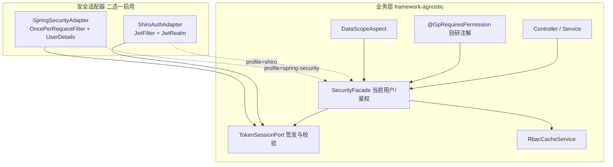

# 可插拔鉴权：在保留现有 Shiro+JWT 的同时接入 Spring Security

> 后端文档第 2 篇｜**文档级设计，根据自身需要改代码**  
> 结论先行：**可以**在业务协议不变的前提下，把「安全框架」做成可切换实现；推荐先抽象端口、默认继续跑 Shiro，再增量提供 Spring Security 实现，用配置切换。

后端仓库：`GeekPlus-Blog-API`（与本前端仓库并列）

---

## 一、现状判断（扫描结论）

| 项 | 现状 |
|----|------|
| 主框架 | **Apache Shiro 1.7.1**（`framework/jwtshiro/ShiroConfig`） |
| 凭证 | 自研 / 内置 `jwt-plus`（`JwtUtil` / `Jet`） |
| 会话 | Redis：`user:login:{username}` + 在线 JTI 列表；Shiro Session **关闭** |
| 请求头 | `Plus-Token`（可剥 `Bearer `） |
| 方法鉴权 | `@RequiresPermissions` / `@RequiresRoles`（Shiro AOP） |
| 权限数据 | `RbacCacheService`：Caffeine L1 + Redis L2，按角色存 perms/menus |
| Spring Security | **未引入**（pom 里仅有注释掉的依赖；偶发注释掉的 `@PreAuthorize`） |
| 遗留 | `framework/shiro/*` 大量注释；`UserJwt*` 客户侧代码存在但过滤器未挂链 |

一句话：现在是 **Shiro 过滤器 + JWT 校验 + Redis 会话 + 角色缓存**，不是「半套 Security」。

---

## 二、目标：同时保留与可快速更换

### 2.1 要什么

1. **今天**：继续用现有 Shiro+JWT，业务、前端、Redis Key、菜单协议不动  
2. **明天**：通过配置 `security.provider=shiro|spring-security` 切换实现  
3. **业务层**：Controller / Service **不直接依赖** `SecurityUtils`、`Subject`、`@RequiresPermissions`（或经薄适配层）  
4. **前端**：默认零改；若切到标准 `Authorization: Bearer`，只改 `request.js` 两处配置  

### 2.2 不要什么

- 不要「双框架同时拦同一条链」（Shiro Filter + Security Filter 叠两道，难排障）  
- 不要为了 Security 改掉 `getMenu` 的 `menuList/permsSet/roles` 契约  
- 不要把 RBAC 缓存、SSO、数据权限推倒重来——它们应落在框架无关层  

---

## 三、推荐架构：端口 + 双适配器



### 3.1 端口（建议包名）

```text
com.geekplus.security.spi
  TokenSessionPort          # create / verify / refresh / invalidate / getLoginUser
  PermissionQueryPort       # resolvePerms / resolveRoles（可直接委托 RbacCacheService）
  SecurityFacade            # 给业务用的唯一入口：currentUser()、hasPerm()、hasRole()
  AuthFilterChainCustomizer # 注册匿名路径、资源签名路径
```

现有 `SysUserTokenService`、`RbacCacheService`、`LoginUser` **尽量原样实现端口**，不要先重写业务。

### 3.2 方法级权限注解策略（关键）

| 策略 | 做法 | 优劣 |
|------|------|------|
| **A. 自研注解 + 统一切面（推荐）** | `@GpRequiresPermission("sys:user:list")`，切面调 `SecurityFacade` | 换框架零改 Controller |
| B. 双注解并存 | 过渡期同时写 Shiro 与 `@PreAuthorize` | 啰嗦，易漏 |
| C. 编译期/构建生成 | 少见，成本高 | 不建议 |

迁移期可用「切面识别 Shiro 注解」做兼容，再逐步换成自研注解。

### 3.3 过滤器：同一时刻只启用一套

```yaml
geekplus:
  security:
    provider: shiro   # 或 spring-security
```

- `provider=shiro`：现有 `ShiroConfig` + `JwtFilter`（现状）  
- `provider=spring-security`：`SecurityFilterChain` + `JwtAuthenticationFilter`，**不注册** Shiro `DelegatingFilterProxy`  

用 `@ConditionalOnProperty` 互斥，避免双链。

---

## 四、Spring Security 接入的具体落地步骤

### 阶段 0：抽端口（不切换框架）

1. 定义 `TokenSessionPort`，`SysUserTokenService` 实现之  
2. 定义 `SecurityFacade`，内部暂用 `SecurityUtils.getSubject()` / `tokenService.getLoginUser`  
3. `BaseController.getLoginUser()`、`DataScopeAspect`、`OperateLogAspect` 改为只依赖 Facade  
4. 新增 `@GpRequiresPermission` 切面；新接口优先用它；旧 `@RequiresPermissions` 由兼容切面转发  

**验收**：全站行为不变，但仍是 Shiro。

### 阶段 1：Spring Security 适配器（旁路可测）

依赖（示意）：

```xml
<dependency>
  <groupId>org.springframework.boot</groupId>
  <artifactId>spring-boot-starter-security</artifactId>
</dependency>
```

核心组件：

| 组件 | 职责 |
|------|------|
| `JwtAuthenticationFilter` | 读 `Plus-Token`（或 `Authorization`），调 `TokenSessionPort.verify`，写入 `SecurityContext` |
| `LoginUserDetails` | 包装 `LoginUser` + `GrantedAuthority`（`ROLE_` + perm 字符串） |
| `SecurityConfig` | `csrf.disable()`（Token 头模式）、`sessionCreationPolicy(STATELESS)`、`authorizeHttpRequests` 对齐现有 anon 列表 |
| `MethodSecurity` | `@EnableMethodSecurity`；若继续用自研注解则可不依赖 `@PreAuthorize` |

匿名路径从现有 `ShiroConfig` 的 map **原样搬成** `requestMatchers(...).permitAll()`（登录、验证码、`/geekplusapp/**`、WS 等）。

### 阶段 2：配置切换与回归

1. 测试环境 `provider=spring-security`  
2. 回归：登录 / 续期 / SSO 踢人 / `@GpRequiresPermission` / 数据权限 / 在线用户强制下线 / 前台匿名接口  
3. 生产默认仍 `shiro`，灰度切 Security  

### 阶段 3（可选）：协议对齐业界默认

- 响应仍返回 `data.token`  
- 请求头可同时接受 `Plus-Token` 与 `Authorization: Bearer`（Filter 内归一）  
- 前端只需：

```js
// src/utils/request.js
tokenHeader: 'Authorization',
formatToken: (t) => `Bearer ${t}`,
```

Cookie 名可继续叫 `Plus-Token`，与头部分开。

---

## 五、两套实现对照（便于评审）

| 能力 | Shiro 实现（现状） | Spring Security 实现（目标） |
|------|-------------------|------------------------------|
| 入口 Filter | `JwtFilter` | `JwtAuthenticationFilter` |
| 认证 | `JwtRealm.doGetAuthenticationInfo` | `AuthenticationManager` / 直接设 `SecurityContext` |
| 鉴权 | Realm + `@RequiresPermissions` | `SecurityFacade` / `@PreAuthorize` / 自研切面 |
| 当前用户 | `SecurityUtils.getSubject().getPrincipal()` | `SecurityContextHolder` → `LoginUser` |
| 会话 | Redis（共用） | Redis（共用，**不要**改成 HttpSession） |
| RBAC | `RbacCacheService`（共用） | 同上 |
| 异常 | Shiro `Unauthenticated/Unauthorized` | `AuthenticationEntryPoint` / `AccessDeniedHandler` → 现有 `Result` JSON |

**共用层（禁止复制两份）**：`SysUserTokenService`、`RbacCacheService`、`LoginUser`、SSO 在线列表、登录日志异步、数据权限 SQL 拼装。

---

## 六、风险与规避

| 风险 | 规避 |
|------|------|
| Shiro 与 Security 依赖冲突 / 双 Filter | 条件装配，同时只启用一个 |
| 注解混用漏拦 | 统一 Facade + 自研注解；集成测试扫「无注解的写接口」 |
| 前端 401 形态变化 | 保持 HTTP 401 + body `code` 兼容（现有 `createRequest` 已双识别） |
| Customer 端 JWT 未挂链 | 接入时一并纳入 `AuthFilterChainCustomizer`，或明确继续 anon |
| 方法安全表达式与 perm 字符串 | Authority 直接用 `sys:user:list`，与现网 permsSet 一致，勿强行加 `ROLE_` 前缀到按钮权限 |

---

## 七、前端需要配合的点（小改）

| 场景 | 前端动作 |
|------|----------|
| 仍用 `Plus-Token` | **无需改** |
| 改为 Bearer | `request.js` 的 `tokenHeader` + `formatToken`；顺带统一 `UploadImage` / `downloadZip` / `fileTransfer` / `onlineresume` 里手写头 |
| Cookie Session + CSRF（一般不推荐博客 API） | `withCredentials` + CSRF 头；本方案默认 **不走这条** |
| `getMenu` | 保持字段：`menuList`、`permsSet`、`roles`、`roleNames`、`userType`、`permVer`（建议前端真正消费 `permVer`） |
| 登录页 | 继续 `data.token`；验证码协议不变 |

详见本仓库 [01-全栈技术架构与前后端协作.md](./01-全栈技术架构与前后端协作.md) 中的契约表。

---

## 八、决策建议

1. **短期**：抽 `SecurityFacade` + 自研注解，业务脱钩 Shiro API——这是「可更换」的真正前提。  
2. **中期**：补 Spring Security 适配器，测试环境可切换，生产默认 Shiro。  
3. **不要**：为了「用上 Security」同步大改 Redis 会话模型或前端动态路由。  
4. **缓存与会话瘦身**：与框架无关，继续按 [03 篇](./03-Caffeine与Redis双重缓存与会话瘦身.md) 推进。  
5. **数据权限**：切 Security 后仍走框架无关的 `@DataScope`；细粒度规则可对标 Jeecg——见 [08 篇](./08-SpringSecurity下的数据权限与Jeecg对照.md)。  

---

## 上下篇

- 上一篇：[01-全栈技术架构与前后端协作.md](./01-全栈技术架构与前后端协作.md)  
- 下一篇：[03-Caffeine与Redis双重缓存与会话瘦身.md](./03-Caffeine与Redis双重缓存与会话瘦身.md)  
- 延伸：[08-SpringSecurity下的数据权限与Jeecg对照.md](./08-SpringSecurity下的数据权限与Jeecg对照.md)
