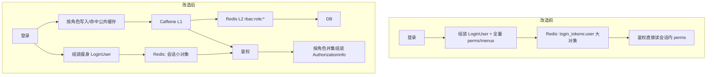

# 从「会话里塞整包权限」到 Caffeine + Redis：双重缓存与会话瘦身方案

> 后端文档第 3 篇｜独立成文｜面向：Spring Boot + Redis + Shiro/JWT 一类中后台 / 博客一体站后端
> 本文档维护于本仓库 `GeekPlus-Blog-API/docs/`  
> 基线假设：改造前，登录用户 `LoginUser`（含角色、部门、**整份权限 Set / 菜单列表**）整体序列化进 Redis，每次鉴权从会话里取  
> 本文只谈两件事：**Redis 会话瘦身** + **Caffeine（L1）配合 Redis（L2）双重缓存**  
> 性质：**技术方案与核心示例代码**，便于按模块落地；不是变更清单，也不要求你先回退现有代码

---

## 写在前面：基线长什么样

典型「权限后台改造站」后端常见写法是：

1. 登录成功 → 查用户 + 角色 + **全部菜单/按钮权限**  
2. 打成 `LoginUser`，`redis.set(login_tokens:{username}, loginUser, expire)`  
3. JWT 只带用户标识；过滤器 / Realm 用 token 找回会话  
4. `doGetAuthorizationInfo` 直接读 `loginUser.getSysMenuList()`（权限字）

好处是简单：会话自包含，鉴权不二次查库。  
代价也很直白：

| 问题 | 表现 |
|------|------|
| Redis 按「用户」复制 | 100 人同一角色 = 100 份相同权限 JSON |
| 会话体积大 | 菜单树 + 按钮权限上千条时，单 key 可达几十～上百 KB |
| 写放大 | 每次续期 / 刷新会话都整对象重写 |
| 改菜单难一致 | 要扫在线用户或等会话过期 |
| Redis QPS | 热点配置、字典、角色权限每次都打 Redis，无本地缓冲 |

本文方案不改登录协议、不改前端 token 头，只把「**谁拥有什么权限**」从「每人一份会话大包」抽成「**按角色一份公共缓存**」，并用 Caffeine 挡住重复读 Redis。

---

## 一、目标与边界

### 1.1 要达成什么

1. **会话瘦身**：Redis 里的 `LoginUser` 只保留身份与会话元数据（userId、角色摘要、IP、UA、登录时间等），**不再长期保存大权限 Set / 全量菜单列表**  
2. **双重缓存**：业务热点（角色权限、角色菜单、配置、字典等）走 `Caffeine → Redis → DB`  
3. **共享命中**：同一角色多用户共享一份 `rbac:role:*`，用户数上去时 Redis 内存近似「角色数 × 权限体积」，而不是「在线用户数 × 权限体积」  
4. **可失效**：改角色菜单 / 权限后能按角色踢缓存；多实例靠短 TTL + 主动 evict 收敛

### 1.2 明确不做什么（本文范围外）

- 不重做 JWT / Shiro 过滤器链  
- 不讨论 App / Web 双端 SSO、jti 多端策略的细节（可另文）  
- 不把「登录日志同步查外网 IP」这类问题混进本文（那是登录链路优化）  
- **会话本体不进 Caffeine**：在线状态、踢人、多实例一致性仍以 Redis 为准；L1 只缓存「可共享、可短时不一致」的只读热点

---

## 二、总体技术思路



一句话：

- **会话**：回答「这个人是谁、还能不能用」  
- **角色缓存**：回答「这类角色能干什么」  
- **Caffeine**：回答「这台机器最近是不是刚问过 Redis」

---

## 三、分层设计

### 3.1 L1 Caffeine（进程内）

| 项 | 建议 |
|----|------|
| 容量 | `maximumSize` 数千～一万（按角色/配置 key 数量估） |
| TTL | `expireAfterWrite` 2～5 分钟（短于业务可接受的不一致窗口） |
| 存什么 | 角色 perms、角色 menus、部门 dataScope、系统配置、字典… |
| 不存什么 | JWT 会话、验证码、分布式锁、在线 token 列表 |

多实例时：实例 A 改了菜单并删了 Redis，实例 B 的 L1 可能仍旧，直到 TTL 或收到失效信号。短 TTL 是刻意的「最终一致」妥协；若要强一致，可再加 Redis Pub/Sub / 版本号（见后文 `permVer`）。

### 3.2 L2 Redis（集群共享）

| Key 形态 | 含义 |
|----------|------|
| `login_tokens:{username}` | 瘦身后的会话（原有前缀可保持） |
| `rbac:role:perms:{roleId}` | 角色权限字 Set |
| `rbac:role:menus:{roleId}` | 角色菜单列表（含按钮 B，供管理与组装） |
| `rbac:role:depts:{roleId}` | 自定义数据权限部门 ID（可选） |
| `rbac:perm:ver` | 全局权限版本（可选，给前端感知「该重拉菜单」） |
| 配置 / 字典原有 key | 同样可挂到双重缓存封装上 |

**路由侧栏不必再单独存一份** `rbac:role:routes:{roleId}`：  
从 `menus` 过滤 `menuType != 'B'` 即可得到 M/C 路由菜单，少一个 Redis key，也少一次预热查询。

### 3.3 读路径与写路径

```text
读：Caffeine.getIfPresent → Redis.get → DB loader → 回填 L2 + L1
写/失效：先删 Redis，再 invalidate 本地；其它节点靠 L1 TTL 过期
```

不要「先写 L1 再写 Redis」当主路径：进程崩溃会丢；统一以 Redis 为共享真相，L1 只是加速副本。

---

## 四、会话瘦身：改什么、不改什么

### 4.1 改造前（基线）伪代码

```java
// 登录
Set<String> perms = menuService.selectPermsByUserId(userId); // 可能很大
LoginUser loginUser = new LoginUser(sysUser, perms);
redis.set("login_tokens:" + username, loginUser, expireSeconds);

// Realm
Set<String> perms = loginUser.getSysMenuList();
info.addStringPermissions(perms);
```

### 4.2 改造后会话里留什么

建议 `LoginUser` 仍序列化进 Redis，但字段收敛为：

- 身份：`userId` / `username` / `nickname` / `avatar` / `userType`  
- 角色摘要：`List<SysRoleVO>`（`roleId`、`roleKey`、`roleName`、`dataScope` 即可）  
- 会话元数据：`loginIp`、`loginLocation`、`browser`、`os`、`loginTime`  
- **显式置空**：`sysMenuList = null`（大权限集）

部门对象若很大，也可只留 `deptId` + 名称等展示字段。

### 4.3 写入会话时强制瘦身

```java
public void refreshRedisUser(LoginUser loginUser) {
    // 会话瘦身：权限不进 Redis，鉴权时按角色从公共缓存组装
    loginUser.setSysMenuList(null);
    redisUtil.set(getTokenKey(loginUser.getUsername()), loginUser, expireTime, TimeUnit.SECONDS);
}
```

登录时可以仍然「查一次权限」用于校验账号可用性，但**不要把结果写进会话**；或登录只查角色 ID，权限交给缓存懒加载。

### 4.4 Realm 组装权限

```java
@Override
protected AuthorizationInfo doGetAuthorizationInfo(PrincipalCollection principals) {
    LoginUser user = (LoginUser) principals.getPrimaryPrincipal();
    List<SysRoleVO> roles = user.getSysRoleList();

    SimpleAuthorizationInfo info = new SimpleAuthorizationInfo();
    info.addRoles(roles.stream()
            .map(SysRoleVO::getRoleKey)
            .filter(StringUtils::isNotEmpty)
            .collect(Collectors.toSet()));

    // 核心：按角色从双重缓存取并集
    Set<String> perms = rbacCacheService.resolvePerms(roles);
    // 兼容尚未瘦身的老会话
    if ((perms == null || perms.isEmpty()) && user.getSysMenuList() != null) {
        perms = user.getSysMenuList();
    }
    info.addStringPermissions(perms);
    return info;
}
```

`getMenu` 接口同理：菜单树用 `resolveMenus` / `resolveRouteMenus`，不要再依赖会话里的大列表。

---

## 五、双重缓存核心封装

依赖（Maven）：

```xml
<dependency>
    <groupId>com.github.ben-manes.caffeine</groupId>
    <artifactId>caffeine</artifactId>
</dependency>
```

Spring Boot 2.x 一般已传递 caffeine；显式声明版本更稳妥。

### 5.1 `TwoLevelCache` 核心示例

```java
@Component
public class TwoLevelCache {

    private final Cache<String, Object> local = Caffeine.newBuilder()
            .maximumSize(10_000)
            .expireAfterWrite(3, TimeUnit.MINUTES)
            .build();

    @Resource
    private RedisUtil redisUtil;

    @SuppressWarnings("unchecked")
    public <T> T get(String key, Supplier<T> loader) {
        Object localVal = local.getIfPresent(key);
        if (localVal != null) {
            return (T) localVal;
        }
        Object redisVal = redisUtil.get(key);
        if (redisVal != null) {
            local.put(key, redisVal);
            return (T) redisVal;
        }
        T loaded = loader.get();
        if (loaded != null) {
            put(key, loaded);
        }
        return loaded;
    }

    public void put(String key, Object value) {
        if (key == null || value == null) {
            return;
        }
        redisUtil.set(key, value);          // L2 先落共享层
        local.put(key, value);              // 再填 L1
    }

    public void put(String key, Object value, long seconds) {
        if (key == null || value == null) {
            return;
        }
        redisUtil.set(key, value, seconds);
        local.put(key, value);
    }

    public void evict(String key) {
        if (key == null) {
            return;
        }
        redisUtil.del(key);                 // 先共享失效
        local.invalidate(key);
    }

    public void clearLocal() {
        local.invalidateAll();
    }
}
```

要点：

- `loader` 只在 L1、L2 都 miss 时执行，避免缓存击穿时可用「单 key 互斥 / 空值短缓存」再加强（按流量决定）  
- Redis value 需可序列化（与现有 `RedisTemplate` 的 JDK/JSON 序列化保持一致）  
- 给 RBAC key 建议设 Redis TTL（例如 6～24h）或依赖主动 evict，避免永久脏数据

### 5.2 角色级 `RbacCacheService` 核心示例

```java
@Service
public class RbacCacheService {

    private static final String PERMS = "rbac:role:perms:";
    private static final String MENUS = "rbac:role:menus:";

    @Resource
    private TwoLevelCache twoLevelCache;
    @Resource
    private SysMenuMapper sysMenuMapper;

    public Set<String> getRolePerms(Long roleId) {
        return twoLevelCache.get(PERMS + roleId, () -> loadPermsFromDb(roleId));
    }

    public List<SysMenu> getRoleMenus(Long roleId) {
        return twoLevelCache.get(MENUS + roleId, () -> loadMenusFromDb(roleId));
    }

    /** 多角色权限并集 */
    public Set<String> resolvePerms(List<SysRoleVO> roles) {
        Set<String> perms = new HashSet<>();
        if (roles == null) {
            return perms;
        }
        for (SysRoleVO role : roles) {
            if (role != null && role.getRoleId() != null) {
                perms.addAll(getRolePerms(role.getRoleId()));
            }
        }
        return perms;
    }

    /** 多角色菜单并集（含按钮） */
    public List<SysMenu> resolveMenus(List<SysRoleVO> roles) {
        Map<Long, SysMenu> map = new LinkedHashMap<>();
        if (roles == null) {
            return new ArrayList<>();
        }
        for (SysRoleVO role : roles) {
            if (role == null || role.getRoleId() == null) {
                continue;
            }
            for (SysMenu m : getRoleMenus(role.getRoleId())) {
                if (m != null && m.getMenuId() != null) {
                    map.putIfAbsent(m.getMenuId(), m);
                }
            }
        }
        return new ArrayList<>(map.values());
    }

    /** 路由用：内存过滤按钮，不必再占一个 Redis key */
    public List<SysMenu> resolveRouteMenus(List<SysRoleVO> roles) {
        return resolveMenus(roles).stream()
                .filter(m -> m.getMenuType() == null || !"B".equals(m.getMenuType()))
                .collect(Collectors.toList());
    }

    public void evictRole(Long roleId) {
        twoLevelCache.evict(PERMS + roleId);
        twoLevelCache.evict(MENUS + roleId);
        bumpPermVer(); // 可选
    }

    private Set<String> loadPermsFromDb(Long roleId) { /* selectPermsByRoleId + split */ }
    private List<SysMenu> loadMenusFromDb(Long roleId) { /* selectMenusByRoleId */ }
    private void bumpPermVer() { /* INCR rbac:perm:ver */ }
}
```

Mapper 侧建议提供「按角色」查询（而不是只按用户），这样公共缓存粒度才对：

```text
selectPermsByRoleId(roleId)
selectMenusByRoleId(roleId)
```

### 5.3 配置 / 字典同样挂上

会话瘦身解决的是「权限复制」；配置、`sys_dict` 往往是全站热点，同样适合 `TwoLevelCache`：

```java
public String selectConfigByKey(String key) {
    return twoLevelCache.get("sys_config:" + key, () -> configMapper.selectByKey(key));
}
```

改配置后台保存成功后：`twoLevelCache.evict("sys_config:" + key)`。

---

## 六、失效、预热与版本号

### 6.1 何时失效

| 事件 | 动作 |
|------|------|
| 修改角色-菜单绑定 | `evictRole(roleId)` |
| 修改菜单定义（影响多个角色） | 查关联角色批量 evict，或 `evictAllRoles` |
| 修改角色 dataScope / 自定义部门 | `evict` 对应 `rbac:role:depts:{id}` |
| 用户改自己的角色分配 | 会话里角色列表需刷新；权限跟角色走，一般不用清全部 RBAC |

### 6.2 预热策略（建议异步）

- **不要**在 `@PostConstruct` 同步扫全库角色堵启动  
- 用 `ApplicationReadyEvent` + 异步线程池 / 现有 `AsyncManager` 后台预热  
- 登录主路径：**不要同步**再打一遍 `getRolePerms/getRoleMenus`；可异步预热当前用户角色，或完全依赖懒加载

```java
@EventListener(ApplicationReadyEvent.class)
public void onReady() {
    AsyncManager.me().execute(new TimerTask() {
        @Override
        public void run() {
            warmUp(); // 遍历启用角色，getRolePerms + getRoleMenus
        }
    });
}
```

### 6.3 可选：`permVer` 给前端

Redis 维护 `rbac:perm:ver`，菜单变更时 `INCR`。  
`getMenu` 响应带上 `permVer`，前端与本地对比不一致则重新 `addRoute`。  
这不是双重缓存必需件，但对「改权限后前端仍拿旧动态路由」很有用。

---

## 七、落地步骤（按模块，可灰度）

建议在「未改授权结构的基线工程」上按序做，每步可单独验证：

1. **引入 Caffeine + `TwoLevelCache`**，先把「配置 / 字典」迁过去（风险低、收益直观）  
2. **新增按角色查询 Mapper** + `RbacCacheService`  
3. **Realm / getMenu 改为 `resolvePerms` / `resolveRouteMenus`**，仍兼容会话内旧 `sysMenuList`  
4. **`refreshRedisUser` 置空大权限集**（真正瘦身生效）  
5. **角色菜单变更点挂钩 `evictRole`**  
6. **异步预热**（启动 + 可选登录后异步）  
7. 观察：Redis 单会话体积、`rbac:role:*` 命中、鉴权耗时、改菜单后的生效延迟（≈ L1 TTL）

回滚策略（方案层面）：保留「会话内 perms」兼容分支，关掉瘦身写入即可退回旧行为；L1 只是加速层，删掉 Caffeine 仍可只走 Redis L2。

---

## 八、容量与性能怎么估

设：

- 在线用户 \(U\)，独立角色 \(R\)（通常 \(R \ll U\)）  
- 单用户权限 JSON 大小 \(P\)，瘦身后会话大小 \(S\)（\(S \ll P\)）

| 指标 | 改造前量级 | 改造后量级 |
|------|------------|------------|
| 会话内存 | \(U \times (S+P)\) | \(U \times S\) |
| 权限数据 | 含在会话里重复 | \(R \times P\)（再加 Caffeine 每实例一份热数据） |
| 鉴权读 Redis | 几乎每次会话反序列化大对象 | 角色 key 命中后多为 L1 |

Caffeine 额外占用：每实例「热 key × 反序列化对象」，用 `maximumSize` 和短 TTL 卡住上限。  
博客 / 中小中后台：\(R\) 往往几十以内，收益主要在「去掉按用户复制」和「减少 Redis 往返」。

---

## 九、多实例与一致性注意点

1. **L1 短暂脏读**：可接受则用 2～5 分钟 TTL；不可接受则改菜单后 Pub/Sub 广播 `evictLocal`  
2. **序列化一致性**：L2 与历史 Redis 数据用同一套序列化；换 JSON 时注意旧 key 清理  
3. **空结果**：角色无菜单时建议缓存空集合，避免穿透  
4. **不要把会话放进 L1**：踢下线、SSO 替换 token 必须以 Redis 为准  
5. **登录接口别同步做重活**：双重缓存预热、外网 IP 解析都应避开登录返回路径（另文优化）

---

## 十、和「只加 Caffeine、不瘦身」的对比

| 做法 | 效果 |
|------|------|
| 只加 Caffeine 缓存配置/字典 | 减 Redis QPS，**不解决**会话按用户复制权限 |
| 只瘦身会话、权限每次查库 | Redis 变小，DB 压力上来 |
| 瘦身 + Redis 角色缓存、无 Caffeine | 内存结构正确，但仍每次跨进程读 Redis |
| **瘦身 + Caffeine + Redis（本文）** | 结构正确 + 热点本地命中，适合多用户同角色 |

所以本文强调的组合是：**会话变薄（结构）** + **双重缓存（速度）**，缺一不可才算完整方案。

---

## 十一、验收清单

- [ ] 新登录用户 Redis 会话中无大 `sysMenuList` / 等价大字段  
- [ ] 同角色两用户登录后，`rbac:role:perms:{id}` 仅一份  
- [ ] 鉴权、按钮权限、`getMenu` 动态路由与改造前一致  
- [ ] 修改角色菜单后，evict 生效；其它节点最多延迟一个 L1 TTL  
- [ ] 启动预热不阻塞端口就绪  
- [ ] 压测或观察：登录写会话体积下降；重复鉴权 Redis OPS 下降  

---

## 小结

在「JWT + Redis 大会话」的基线工程上，不必先推翻整套授权框架。  
先把权限数据的所有权从「用户会话」挪到「角色公共缓存」，再用 Caffeine 做进程内 L1、Redis 做共享 L2，并用主动失效 + 短 TTL 处理多实例。  

会话回答身份，角色缓存回答能力——这是这篇方案唯一要钉死的模型。

---

## 附录：推荐类与包位置（示例）

```text
com.geekplus.common.cache.TwoLevelCache
com.geekplus.webapp.system.service.cache.RbacCacheService
com.geekplus.framework.jwtshiro.JwtRealm          # resolvePerms
com.geekplus.webapp.common.service.SysUserTokenService  # refreshRedisUser 瘦身
com.geekplus.webapp.common.SysUserLoginController # getMenu 走 resolveRouteMenus
```

常量前缀示例：

```java
String RBAC_ROLE_PERMS = "rbac:role:perms:";
String RBAC_ROLE_MENUS = "rbac:role:menus:";
String RBAC_ROLE_DEPTS = "rbac:role:depts:";
String RBAC_PERM_VER   = "rbac:perm:ver";
```

---

## 上下篇

- 上一篇：[02-可插拔鉴权与SpringSecurity接入方案.md](./02-可插拔鉴权与SpringSecurity接入方案.md)  
- 返回索引：[README.md](./README.md)
