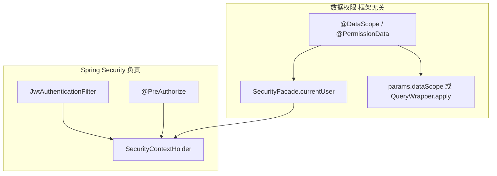

# Spring Security 下的数据权限方案

> 后端文档第 8 篇｜**设计文档，按需落地**  
> 前提：本仓当前是 **Shiro + JWT + `@DataScope`**；第 2 篇已规划可插拔切到 Spring Security。  
> 本文回答：**假如切到 Spring Security（或对标 JeecgBoot），行级数据权限该怎么做**——与「接口能不能访问」解耦。

相关文档：

- [02-可插拔鉴权与SpringSecurity接入方案.md](./02-可插拔鉴权与SpringSecurity接入方案.md)  
- [07-数据权限使用说明.md](./07-数据权限使用说明.md)（现行用法）

---

## 一、先分清两层权限（所有成熟平台通用）

| 层 | 管什么 | Spring Security 典型手段 | 本仓现状 |
|----|--------|---------------------------|----------|
| **功能权限** | 接口 / 按钮 / 菜单 | `SecurityFilterChain` + `@PreAuthorize("hasAuthority('…')")` | Shiro `@RequiresPermissions` + `permsSet` |
| **数据权限** | 同一接口下看到哪些行 | **不在** Security 核心里；用 AOP / QueryWrapper / 拦截器拼 WHERE | `@DataScope` + `${params.dataScope}` |

**结论：** 切到 Spring Security **只替换认证与功能鉴权**；数据权限应继续放在 **框架无关层**（第 2 篇图中的 `DataScopeAspect` / `RbacCacheService`），通过 `SecurityFacade.currentUser()` 取登录人，而不是绑死 `SecurityUtils.getSubject()`。



---

## 二、主流方案对照

### 2.1 部门下数据范围限定——本仓已采用的主路径

| 项 | 做法 |
|----|------|
| 模型 | 角色固定 5 档：`data_scope` 1~5 + 自定 `sys_role_dept` |
| 织入 | `@DataScope(deptAlias, userAlias)` + AOP 写入 `BaseEntity.params.dataScope` |
| 拼 SQL | Mapper XML：`${params.dataScope}` |
| 取用户 | `SecurityUtils.getLoginUser()`（Security 版）或 Shiro Subject（Shiro 版） |
| 优点 | 简单、与部门树天然契合、性能好（常量 SQL 模板） |
| 缺点 | 规则粒度粗，难表达「性别=男」「金额>5000」等业务字段规则 |

本仓对应：`DataScopeAspect`、`DataPermissionHelper`、`RbacCacheService.getRoleDataScope`。

### 2.2 JeecgBoot —— 规则引擎 + MyBatis-Plus（Spring Security 体系）

JeecgBoot 认证侧是 **Spring Security + JWT**，数据权限是另一套：

| 项 | 做法 |
|----|------|
| 模型 | **菜单维度的数据规则**（`sys_permission_data_rule`）：字段 + 运算符 + 值 / 自定义 SQL；再授权给角色 |
| 织入 | 列表接口加 `@PermissionData(pageComponent="system/UserList")`（与前端组件路径对齐） |
| 拼 SQL | `QueryGenerator` / `QueryWrapper`：把规则转成 `eq/like/in/apply(自定义SQL)` |
| 上下文变量 | `#{sys_user_code}`、`#{sys_org_code}` 等注入当前登录人 |
| 多角色 | 常见约定：**同角色内 AND，跨角色 OR**（注意历史版本曾有 AND 踩坑） |
| 优点 | 运营可配细粒度规则，不改代码即可加「只看男用户」等 |
| 缺点 | 依赖 MP QueryWrapper；自定义 SQL 有注入风险，需白名单/参数化；与固定 5 档部门模型不同 |

与本仓差异：**Jeecg 是「按菜单挂规则」**；本仓是「按角色挂部门范围」。二者可并存（见第四节）。

### 2.3 其它常见方案（简表）

| 平台 / 思路 | 数据权限怎么做 | 与 Security 关系 |
|-------------|---------------|------------------|
| **部门和数据范围限定** | 同 2.1；Plus 版 Security + Sa-Token 变体仍用 `@DataScope` | Security 只提供 LoginUser |
| **Guns / 部分 SaaS** | 租户 ID + 部门 scope；MyBatis 拦截器强制加 `tenant_id` | 租户插件与 Security 并行 |
| **MyBatis-Plus 数据权限插件** | `@InterceptorIgnore` / `DataPermissionInterceptor` 按注解拼 SQL | 不依赖 Security |
| **自研「行 ACL」** | 资源-主体授权表，列表 `EXISTS` 子查询 | 最灵活、成本最高 |

---

## 三、切到 Spring Security 后：推荐落地（本仓）

目标：**不推倒现有 5 档 `data_scope`**，只换「当前用户从哪来」。

### 3.1 保留层（零改或微改）

- `sys_role.data_scope` / `sys_role_dept`  
- `RbacCacheService`（含 `getRoleDataScope`）  
- `DataScopeAspect` 拼 SQL 逻辑、Mapper `${params.dataScope}`  
- `DataPermissionHelper`（单条 / 部门树）  
- 前端 `getMenu` / `Plus-Token` 契约（见第 2 篇）

### 3.2 必改点：取登录用户

现状（Shiro）：

```java
SecurityUtils.getSubject().getPrincipal(); // LoginUser
```

切 Security 后（建议经 Facade，与第 2 篇一致）：

```java
public interface SecurityFacade {
    LoginUser currentUser();
    boolean hasAuthority(String perm);
}

// Spring Security 适配器
public LoginUser currentUser() {
    Authentication auth = SecurityContextHolder.getContext().getAuthentication();
    if (auth == null || !(auth.getPrincipal() instanceof LoginUser)) {
        return null;
    }
    return (LoginUser) auth.getPrincipal();
}
```

`DataScopeAspect` **只依赖 `SecurityFacade`**，禁止再直接调 Shiro/Security 静态工具。

### 3.3 功能权限对照

| Shiro 今 | Spring Security 建议 |
|----------|----------------------|
| `@RequiresPermissions("system:user:list")` | `@PreAuthorize("hasAuthority('system:user:list')")` 或自研 `@GpRequiresPermission` → Facade |
| `JwtFilter` + `JwtRealm` | `OncePerRequestFilter` 验 JWT → 填 `SecurityContext` + 同一套 `TokenSessionPort` |
| anon 路径 | `authorizeHttpRequests().requestMatchers(...).permitAll()` |

数据权限注解 **继续用 `@DataScope`**，不要改成 `@PreAuthorize`（语义不同）。

### 3.4 认证链路示意（Security 版）

```text
HTTP
  → JwtAuthFilter（Security）
       验 Plus-Token / Bearer → TokenSessionPort → LoginUser
       SecurityContext.setAuthentication(UsernamePasswordAuthenticationToken(loginUser, …, authorities))
  → FilterSecurityInterceptor / @PreAuthorize（功能权限）
  → Controller
  → Service @DataScope
       SecurityFacade.currentUser() → 拼 params.dataScope
  → MyBatis ${params.dataScope}
```

`authorities` 建议来自现有 `RbacCacheService.resolvePerms(roles)`，与 `getMenu.permsSet` 同源。

### 3.5 配置开关（与第 2 篇对齐）

```yaml
geekplus:
  security:
    provider: spring-security   # 或 shiro
```

同一时刻只启用一套 Filter 链；**DataScopeAspect 始终启用**。

---

## 四、可选增强：JeecgBoot 式「菜单数据规则」（不替换 5 档）

若业务需要「按字段规则」而不仅是部门范围，可在 **保留 `@DataScope` 部门档** 之上增量引入规则表（对标 Jeecg）：

### 4.1 表设计（示意）

```text
sys_data_rule
  id, menu_id/page_component, rule_column, rule_condition, rule_value, status

sys_role_data_rule
  role_id, rule_id
```

`rule_value` 支持字面量或上下文：`#{username}`、`#{deptId}`、`#{userId}`（由 Facade 解析）。

### 4.2 织入方式二选一

| 方式 | 适用 | 说明 |
|------|------|------|
| **A. 扩展现有 Aspect** | 继续纯 MyBatis XML | `@DataScope` 之外再跑规则引擎，把额外 AND/OR 片段 append 进 `params.dataScope` |
| **B. Jeecg 式 QueryWrapper** | 新模块上 MP | `@PermissionData` + `QueryGenerator.installRules(wrapper)`；与旧 XML 模块并存 |

多角色建议：**部门档仍用现有并集（OR）**；字段规则采用 Jeecg 惯例——**同角色 AND、跨角色 OR**，并在文档中写死，避免歧义。

### 4.3 与 Spring Security 的边界

- `@PreAuthorize`：有没有「用户列表」按钮  
- `@DataScope`：部门 1~5  
- `@PermissionData` / 规则引擎：额外业务字段过滤  

三者可同时生效：最终 SQL ≈ `功能已放行` ∧ `部门范围` ∧ `数据规则`。

---

## 五、迁移阶段建议

| 阶段 | 内容 | 数据权限 |
|------|------|----------|
| **P0** | 抽象 `SecurityFacade` / `TokenSessionPort`；Aspect 改走 Facade | 行为不变 |
| **P1** | 实现 Security 适配器 + `@PreAuthorize` 双轨或替换 Shiro 注解 | 仍用 `@DataScope` |
| **P2** | 配置切换 `provider=spring-security`，下线 Shiro Filter | 回归用户/部门列表与树 |
| **P3（可选）** | 引入 Jeecg 式 `sys_data_rule` | 先挂 1～2 个菜单试点 |

**不要**在 P1 同时换 Security + 换数据权限模型，排障面会翻倍。

---

## 六、安全与性能注意

1. **`${…}` 拼接**：仅允许 Aspect/规则引擎写入；请求入口必须先 `clearDataScope`（本仓已做）。自定义 SQL 规则禁止直接拼用户输入。  
2. **PageHelper**：插件须拦截 6 参 `Executor.query`（本仓 `DataScopeInterceptor` 已处理）。  
3. **缓存**：`data_scope` / 规则列表走 `RbacCacheService` 或独立 L1/L2，改角色后 `evict` + 前端「刷新权限」。  
4. **SecurityContext**：异步线程要 `DelegatingSecurityContextRunnable`，否则 Facade 取不到用户 → 数据权限失效或误拒。  
5. **Jeecg 自定义 SQL**：优先参数化；对 `apply(sql)` 做关键字黑名单或仅允许运维角色配置。

---

## 七、决策建议（给本仓）

| 诉求 | 建议 |
|------|------|
| 尽快切 Security，部门数据范围够用 | **P0→P2**，保留`@DataScope` |
| 要运营可配字段规则（像 Jeecg） | P2 稳定后做 **P3**，不要替换 5 档，而是叠加 |
| 多租户 SaaS | 另增 `tenant_id` 强制条件（插件），与部门 scope 正交 |

一句话：**Spring Security 换的是「门禁」；数据权限继续用本仓已验证的拼 SQL 层，需要细规则再学 Jeecg 加规则引擎。**

多租户（`tenant_id`）与上述两层正交，见 [09-多租户SaaS改造技术方案.md](./09-多租户SaaS改造技术方案.md)。

---

## 八、关键类映射（现状 → Security 后）

| 职责 | 现状 | Security 后 |
|------|------|-------------|
| 登录用户 | Shiro Principal `LoginUser` | `SecurityContext` Principal 仍为 `LoginUser` |
| 取用户给 DataScope | `SecurityUtils.getSubject()` | `SecurityFacade.currentUser()` |
| 功能鉴权 | `@RequiresPermissions` | `@PreAuthorize` / `@GpRequiresPermission` |
| 行级过滤 | `DataScopeAspect` + XML | **不变** |
| 细粒度规则（可选） | 无 | `sys_data_rule` + `@PermissionData` 或扩展 Aspect |
