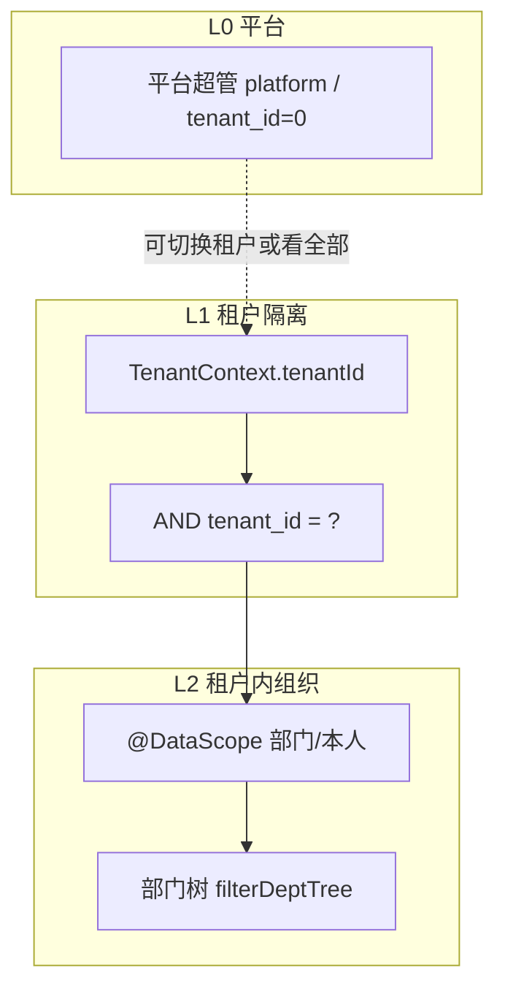
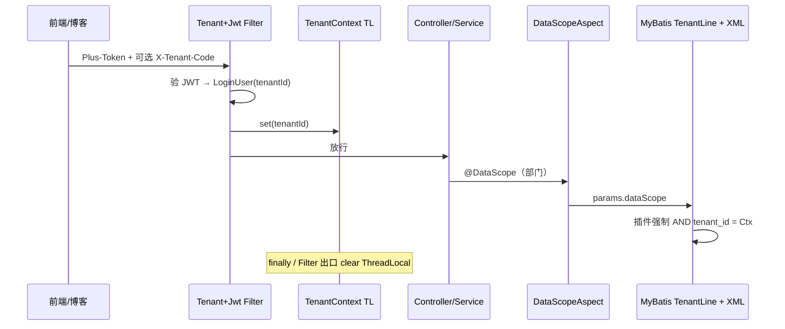

# 多租户（SaaS）改造技术方案

> 后端文档第 9 篇｜**规划文档，按需分阶段落地**  
> 前提：当前是单库单租户中后台 + 博客一体站（Shiro/JWT、部门 `data_scope`、Rbac 双重缓存、SSE/WS）。  
> 目标：后期可演进为 **共享库 + `tenant_id` 行隔离** 的多租户，且与现有行级数据权限、鉴权可插拔方案正交，避免推倒重来。

相关文档：

- [01-全栈技术架构与前后端协作.md](./01-全栈技术架构与前后端协作.md)  
- [02-可插拔鉴权与SpringSecurity接入方案.md](./02-可插拔鉴权与SpringSecurity接入方案.md)  
- [03-Caffeine与Redis双重缓存与会话瘦身.md](./03-Caffeine与Redis双重缓存与会话瘦身.md)  
- [07-数据权限使用说明.md](./07-数据权限使用说明.md)  
- [08-SpringSecurity下的数据权限与Jeecg对照.md](./08-SpringSecurity下的数据权限与Jeecg对照.md)

---

## 一、要不要上多租户（决策）

| 诉求 | 建议 |
|------|------|
| 只有自家博客 + 一套后台 | **不上**；继续用部门 `data_scope` 即可 |
| 要给多家客户各一套「组织/用户/角色/内容」，彼此数据隔离 | **要**；走本文共享库方案 |
| 强合规、租户间物理隔离、独立升级 | 独立库/独立实例（成本高，本文仅作对照，不作为本仓默认） |

一句话：**部门数据权限 ≠ 多租户。**  
`data_scope` 管「同一组织内看到哪些行」；`tenant_id` 管「不同客户之间的硬隔离」。二者叠加：`租户条件 ∧ 部门范围`。

```text
请求可见数据 = 当前 tenant_id 内的行  ∩  角色 data_scope（全部/本部门/本人…）
```

---

## 二、成熟方案对照与本仓选型

| 模式 | 做法 | 代表 | 对本仓 |
|------|------|------|--------|
| **A. 共享库 + tenant_id 列** | 业务表加租户字段；登录解析租户；SQL/拦截器强制加条件 | RY等多数中后台 SaaS | **推荐默认** |
| **B. 共享库 + Schema** | 每租户一个 schema | 部分 Oracle/PG 产品 | 运维重，MySQL 不友好 |
| **C. 独立库 / 独立部署** | 每租户一套库或一套服务 | 金融/强隔离 | 可作大客户加购，不改主架构 |

**本仓选型：A（共享库 + `tenant_id`）**，原因：

1. 与现有 MyBatis XML、`@DataScope`、PageHelper、Rbac 缓存改造路径最短  
2. 博客侧可按租户区分站点内容，也可保留「平台公共内容」例外表  
3. 与第 2 篇 Security 可插拔、第 3 篇缓存瘦身不冲突——租户只是多一层上下文与 Key 维度  

---

## 三、权限三层模型（改造后）



| 层 | 谁 | 能力 |
|----|-----|------|
| **平台** | `userId` 平台超管或 `user_type=platform` | 开户、停用租户、切租户排查；**默认不进业务列表全库扫**（显式切换） |
| **租户管理员** | 租户内 `role_key` 类 admin | 管本租户用户/角色/部门/菜单子集；`data_scope` 可配 |
| **普通用户** | 租户内角色 | 功能权限 + 行级 `data_scope` |

**禁止**：用「部门=全部」冒充跨租户；跨租户只能平台能力。

与现网关系：

- 现 `AdminAuthUtils.isDataScopeBypass`（仅 `userId=1`）→ 演进为 **平台超管** 或 **租户内豁免** 两套方法，勿混用  
- 现 `@DataScope` / 部门树裁剪 → **原样保留**，外层再套租户条件  

---

## 四、与本仓模块的映射

| 模块 | 现状 | 多租户改造要点 |
|------|------|----------------|
| 登录 / JWT / Redis 会话 | `user:login:{username}`、`LoginUser` | 会话与 JWT 声明带 `tenantId`；用户名建议改为 **租户内唯一**（或 `username+tenant` 复合登录） |
| `RbacCacheService` | `rbac:role:perms:{roleId}` | Key 加租户：`rbac:{tenantId}:role:perms:{roleId}`；`permVer` 按租户或全局分段 |
| `@DataScope` | 拼部门/本人 | 拦截器/切面 **先** 拼 `tenant_id`，**再** 拼部门；租户条件不可被前端 `params` 覆盖 |
| 部门树 | `filterDeptTree` | 树数据源已按租户查；再裁 `data_scope` |
| 菜单 `sys_menu` | 全局一份 | **策略二选一**：① 菜单模板全局 + 租户启用子集；② 每租户复制菜单（简单但膨胀）。推荐 ① |
| 博客公开 API `/geekplusapp/**` | anon | 用域名 / `X-Tenant-Code` / 站点配置解析租户；匿名接口也必须带租户，防串站 |
| SSE / WS | 按用户推送 | 连接绑定 `tenantId`；广播禁止跨租户 |
| 文件 / 上传 | 本地或对象存储 | 路径或 bucket 前缀加 `tenantId` |
| 定时任务 / Quartz | 全局 | 任务参数带租户或拆「每租户任务」 |
| 字典 / 配置 | 偏全局 | 分「平台配置」与「租户配置」表或 `tenant_id` 可空表示平台默认 |

---

## 五、数据模型（示意）

### 5.1 租户主表

```sql
CREATE TABLE sys_tenant (
  tenant_id     BIGINT PRIMARY KEY AUTO_INCREMENT,
  tenant_code   VARCHAR(64)  NOT NULL UNIQUE,  -- 登录/域名用
  tenant_name   VARCHAR(128) NOT NULL,
  status        CHAR(1)      NOT NULL DEFAULT '0', -- 0正常 1停用
  expire_time   DATETIME     NULL,
  package_id    BIGINT       NULL,               -- 套餐/菜单包，可选
  create_time   DATETIME,
  remark        VARCHAR(500)
);
```

约定：

- **`tenant_id = 0`（或 NULL 策略二选一，建议 0）**：平台数据 / 平台超管归属  
- 业务表 **NOT NULL** 的 `tenant_id`，历史数据迁移脚本一律刷成 `0` 或默认租户 `1`

### 5.2 哪些表加 `tenant_id`

| 类别 | 表（示例） | 是否加 |
|------|------------|--------|
| 强隔离 | `sys_user`、`sys_dept`、`sys_role`、`sys_role_menu`、`sys_role_dept`、`sys_user_role`、操作/登录日志 | **必须** |
| 内容（博客） | 文章、分类、标签、评论、友链、轮播、站点信息等 `gp_*` | **必须**（或「平台公共」用 `tenant_id=0` + 查询策略） |
| 可选共享 | `sys_menu`（模板）、部分 `sys_dict`、国家码 | 可不加或 `tenant_id` 可空=平台默认 |
| 关联表 | `sys_role_menu` 等 | 随主表租户；插入时校验 role/menu 同租户 |

唯一约束改造示例：

```text
sys_user: UNIQUE(tenant_id, username)
sys_role: UNIQUE(tenant_id, role_key)
sys_dept: 树仍在租户内；dept_id 可全局自增
```

### 5.3 套餐与菜单（推荐）

```text
sys_tenant_package     -- 套餐
sys_tenant_package_menu -- 套餐含哪些菜单模板 id
租户启用后：租户管理员只能在本套餐菜单子集内授权给角色
```

避免每个租户复制整棵 `sys_menu`，减少缓存与升级成本。

---

## 六、运行时架构



### 6.1 租户解析顺序（写死优先级）

1. **已登录**：以会话 / JWT 内 `tenantId` 为准（防头篡改）  
2. **登录接口**：`tenantCode`（表单）或域名映射 → 查 `sys_tenant` → 再验用户  
3. **匿名博客**：域名 / `X-Tenant-Code` / 默认租户配置  
4. **平台超管「切租户」**：仅平台接口允许临时覆盖 `TenantContext`（写审计日志）

### 6.2 核心组件（建议包名）

| 组件 | 职责 |
|------|------|
| `TenantContext` | ThreadLocal 存 `tenantId`；try-finally / Filter 出口清理（同 `DataScopeContext`） |
| `TenantLineInnerInterceptor` 或自研 `TenantSqlInterceptor` | 对标注/默认表自动 `AND tenant_id = ?`；忽略表白名单（如 `sys_tenant`、菜单模板） |
| `TenantIgnore` | 方法或 Mapper 级忽略（平台巡检、迁移任务） |
| `LoginUser.tenantId` | 会话瘦身字段；进 Redis |
| 缓存 Key | 凡角色/配置/字典租户相关一律带 `tenantId` |

**强制规则（代码质量，同仓 performance 规则）：**

- ThreadLocal 必须清理  
- 批量 evict 时 `permVer` **按租户 bump 一次**，禁止循环递增  
- 禁止业务 SQL 手写信任前端传入的 `tenantId`  

### 6.3 与 `@DataScope` 的拼接顺序

```text
WHERE ... 
  AND /*GP_TENANT*/ tenant_id = {ctx}     -- 插件强制，不可空
  AND /*GP_DATA_SCOPE*/ ( dept_id = ... ) -- 现有切面，租户内再过滤
```

插件插在 PageHelper 之前或之后需联调；与现有 `DataScopeInterceptor` 一样要拦 **4/6 参** `Executor.query`，并处理 `update/delete`。

---

## 七、前端与契约

| 项 | 建议 |
|----|------|
| 登录页 | 增加「租户编码」或子域名进入；本地开发可用默认 `tenantCode` |
| Token | 仍 `Plus-Token`；payload/会话含 `tenantId`（前端一般不解析，仅展示租户名） |
| `getMenu` | 仍 `menuList/permsSet/...`；可选回传 `tenantId/tenantName` |
| 平台控制台 | 独立路由前缀如 `/platform/tenants`；与 `/admin` 租户后台分离 |
| 博客前台 | 按域名解析租户；静态资源 CDN 路径带租户前缀更佳 |

前端细文可落在兄弟仓 `docs/v2`；本篇只定契约。

---

## 八、分阶段落地（与现网并行）

> **不要**与「切 Spring Security」「大改数据权限模型」同一迭代。优先 Stabilise 现有 `@DataScope`（Controller）后再开租户。

| 阶段 | 内容 | 产出 | 风险控制 |
|------|------|------|----------|
| **T0 预埋（可现在做）** | 文档约定；新表设计带 `tenant_id` 可选；禁止 username 全局业务假设写死 | 规范 | 零行为变化 |
| **T1 模型** | `sys_tenant`；核心 sys_* / 选定 gp_* 加列；迁移刷默认租户；唯一索引改造 | DDL + 回滚脚本 | 只读灰度校验行数 |
| **T2 上下文** | `TenantContext` + Filter；`LoginUser.tenantId`；登录按租户查用户 | 登录隔离 | 单租户配置 `default-tenant-id=1` 行为与今一致 |
| **T3 SQL 强制** | MyBatis 租户插件；忽略表清单；单测防漏网 | 硬隔离 | 全量接口抽检 + 故意跨租户 ID 应 0 行 |
| **T4 缓存** | RBAC/配置 Key 加租户；evict 按租户 | 缓存正确 | 对比切租户后菜单不串 |
| **T5 产品** | 租户 CRUD、套餐菜单、停用/过期、平台切租户 | 运营可用 | 审计日志 |
| **T6 内容与推送** | 博客 anon 解析租户；SSE/WS/文件前缀 | 站点隔离 | 域名映射表 |

**回滚策略：** T2 可用配置 `geekplus.tenant.enabled=false` 关闭插件与上下文，SQL 仍带列但条件不生效（仅紧急；长期应始终强制）。

---

## 九、安全清单

1. **IDOR**：只校验资源主键不够，必须租户条件；详情/改删与列表同一套隔离  
2. **登录枚举**：错误文案不区分「租户不存在 / 用户不存在」过度细节（防探测）  
3. **缓存穿透**：短 TTL + 空值；停用租户立即 `evict` 该租户 RBAC  
4. **定时任务 / 异步**：`@Async` 须传递 `tenantId`（`TaskDecorator` 或显式参数），禁止默默用错误 ThreadLocal  
5. **导出 / 报表**：大数据导出同样带租户，禁止平台接口无租户扫全表除非显式  
6. **超管**：平台账号禁止当普通租户用户名登录进业务租户而不审计  

---

## 十、与「现在就能做的事」（降低后期成本）

即使暂时 `tenant.enabled=false`，建议在迭代中遵守：

1. **新业务表**：预留 `tenant_id BIGINT NOT NULL DEFAULT 1`（或评论说明二期加）  
2. **缓存 Key**：设计时留 `{tenant}` 段，单租户先写死 `1`  
3. **用户名**：文档约定「将来租户内唯一」，避免前端写死全局唯一校验文案与后端强耦合  
4. **继续完善** `SecurityFacade` / `TokenSessionPort`（第 2 篇）：租户上下文挂在 Facade 上，而不是散落 `SecurityUtils`  
5. **DataScope 保持框架无关**：租户插件与部门切面分离，禁止一个 Aspect 里写死所有隔离逻辑导致难测  

---

## 十一、工作量量级（粗估）

| 范围 | 人日量级（供排期） |
|------|-------------------|
| T1 DDL + 迁移 + 核心 sys 表 | 3～5 |
| T2～T3 上下文 + 插件 + 登录改造 | 5～8 |
| T4 缓存与 getMenu/refreshAuth | 2～3 |
| T5 平台租户管理 UI + API | 5～10 |
| T6 博客域名与内容全覆盖 | 5～15（视 gp_* 表数量） |
| 回归（权限/树/推送/上传） | 3～5 |

单租户兼容开关可明显降低上线当晚风险。

---

## 十二、结论

1. **后期可以加**，推荐 **共享库 + `tenant_id` + TenantContext + MyBatis 强制条件**，与现有 `@DataScope`、部门树、Rbac 双重缓存、可插拔鉴权 **叠加而非替换**。  
2. **现在不必上**；先把行级数据权限与会话/缓存做稳，新表预留字段与 Key 规范即可。  
3. 平台 / 租户 / 部门三层权限边界写进评审清单，避免「管理员角色」再次变成跨租户豁免。  
4. 落地顺序：**模型 → 登录上下文 → SQL 强制 → 缓存 → 运营后台 → 博客域名**；配置开关保证可回退。

---

## 十三、关键扩展点（落地时对照）

| 扩展点 | 现状类 | 租户期改动 |
|--------|--------|------------|
| 会话用户 | `LoginUser` | +`tenantId`；`copySessionMetaFrom` 同步 |
| 登录 | `SysUserLoginController` / `SysUserTokenService` | 按租户查用户；Redis Key 建议 `user:login:{tenantId}:{username}` |
| 数据权限 | `DataScopeAspect` | 不负责租户；保持部门逻辑 |
| SQL 插件 | `DataScopeInterceptor` | 旁路新增 `TenantSqlInterceptor`（或 MP TenantLine） |
| RBAC | `RbacCacheService` | Key 与 evict 维度加租户 |
| 部门树 | `DataPermissionHelper` | 数据已租户过滤后再 `filterDeptTree` |
| 鉴权 Facade | 第 2 篇规划 | `currentTenantId()` |
