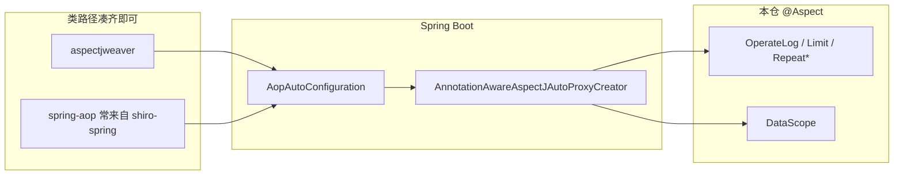

# Spring AOP 切面为何能生效：日志 / 限流 / 防重 与 DataScope

> 后端文档第 10 篇｜澄清依赖与织入条件  
> 回答：为什么以前只有 `aspectjweaver`、操作日志 / 请求限制 / 防重提交 / 防重登录都能用，还要不要 `spring-boot-starter-aop`？数据权限切面出问题是不是因为缺 starter？

相关：

- [07-数据权限使用说明.md](./07-数据权限使用说明.md)  
- `pom.xml`：`spring-boot-starter-aop`、`aspectjweaver`  
- 切面包：`com.geekplus.framework.aspect.*`

---

## 一、结论（先看）

1. **操作日志、限流、防重提交、防重登录能生效，不是因为「只有 aspectjweaver 就够」**，而是当时类路径上已经凑齐了 Spring Boot 自动开启 AOP 的条件，且这些切面都挂在 **Controller** 上、经代理调用。  
2. **`spring-boot-starter-aop` 不是这些切面的「特权开关」**；它是官方推荐的显式依赖，把 `spring-aop` + `aspectjweaver` + 自动配置绑在一起，不依赖 Shiro 等传递依赖「碰巧」带上 AOP。  
3. **DataScope 曾经不进 SQL，主因不是「缺 starter-aop、而日志有」**——同一套 `@Aspect` 基础设施。真正问题在：注解挂错层（Transactional Service）、`params` 字段遮蔽、超管豁免等（见第 7 篇）。把 `@DataScope` 挂回 **Controller** 后与日志切面同一路径。

---

## 二、本仓已有的 `@Aspect` 一览

| 切面 | 切入点 | 注解挂在哪 | 现象 |
|------|--------|------------|------|
| `OperateLogAspect` | `@annotation(Log)` | **Controller** | 早就可用 |
| `RequestLimitAspect` | `@annotation(RequestLimit)` | **Controller** | 早就可用 |
| `RepeatSubmitAspect` | `@annotation(RepeatSubmit)` | **Controller** | 早就可用 |
| `RepeatLoginAspect` | `@annotation(RepeatLogin)` | **Controller**（登录） | 早就可用 |
| `DataScopeAspect` | `@annotation(DataScope)` | 曾挂 **Service**；现挂 **Controller** | 曾失效 → 已与上表对齐 |

共同点：都是 `@Aspect` + `@Component`，走 **Spring AOP 运行时代理**（不是 ajc 编译期织入）。

---

## 三、两段依赖各自干什么

```text
aspectjweaver
  └─ 提供 org.aspectj.lang.annotation.Aspect / 切点表达式解析
  └─  alone：不能让 Spring「自动给 Bean 做代理」

spring-boot-starter-aop
  └─ spring-aop（代理、Advisor 链）
  └─ aspectjweaver（传递依赖，一般不必再手写一份）
  └─ 触发 Boot 自动配置 ≈ @EnableAspectJAutoProxy
```

只声明 weaver：切面类能编译、注解能写；**是否织入**还要看容器有没有注册 `AnnotationAwareAspectJAutoProxyCreator`。

---

## 四、为什么「没写 starter-aop」时日志等仍可能生效

Spring Boot 的 `AopAutoConfiguration`（在 `spring-boot-autoconfigure` 里，**不**要求必须引入 starter-aop 这个 artifact）大致条件是：

- 类路径上有 `Aspect`（← **aspectjweaver**）  
- 有 `Advice` / AOP API（← 通常来自 **spring-aop**）  
- `spring.aop.auto` 默认为 true  

本仓即便早期 **没有** 显式 `spring-boot-starter-aop`，类路径上往往已经有：

| 来源 | 带来什么 |
|------|----------|
| 显式 `aspectjweaver` | `Aspect` 注解、切点解析 |
| **`shiro-spring`**（及 `@Transactional` / 部分 starter） | 传递引入 **`spring-aop`** |
| `spring-boot-autoconfigure` | 检测到上述类 → **自动** `@EnableAspectJAutoProxy` |

因此：`OperateLogAspect` 等与 `DataScopeAspect` **共用同一套自动代理**——日志能拦 Controller，说明当时 **AOP 基础设施是开着的**。



**不要**理解成：「日志用了一套魔法 AOP，DataScope 必须另买 starter」。

---

## 五、那为什么日志一直好使，DataScope 曾不好使？

差异在 **织入目标与业务条件**，不在「有没有单独的 starter-aop 开关」。

| 维度 | 日志 / 限流 / 防重 | DataScope（问题期） |
|------|-------------------|---------------------|
| 注解位置 | Controller 方法 | 曾放在 `@Transactional` 的 **Service** |
| 代理路径 | DispatcherServlet → Controller 代理 → 切面必经 | Service 自调用 / 事务代理 / 注解可见性更容易踩坑 |
| 成败可观察性 | 无日志、被限流、防重报错 → 立刻知道切面在 | 切面没写上只是 SQL 少一段 AND → 像「没开权限」 |
| 其它逻辑 | 无「整段 return」豁免 | `isDataScopeBypass`、`data_scope=1`、空部门等会 **故意不拼 SQL** |
| 参数载体 | 一般不依赖入参 Map | 依赖 `params.dataScope`；子类曾 **遮蔽** `BaseEntity.params` |

当前修正（与日志同源）：

- `@DataScope` 挂在 **Controller** 列表/导出方法（与 `@Log` 同层）  
- 实体只用 `BaseEntity.params`  
- 显式保留 `spring-boot-starter-aop` 作为契约依赖  

---

## 六、Shiro 的 `DefaultAdvisorAutoProxyCreator` 会不会「顺便」开启 @Aspect？

`ShiroConfig` 里有：

```java
DefaultAdvisorAutoProxyCreator ...
  setUsePrefix(true);
  setAdvisorBeanNamePrefix("_no_advisor");
```

这是给 **Shiro 注解鉴权（Advisor）** 用的，且用前缀 **刻意避开** 普通 Advisor，减轻重复代理（Shiro 社区常见写法）。  

**`@Aspect` 切面**靠的是 Boot 的 `AnnotationAwareAspectJAutoProxyCreator`，不是靠上面这个「带 `_no_advisor` 前缀」的 Creator 去扫 `@Aspect`。  

所以：防重/日志能用 ≠ Shiro 的 AutoProxyCreator 在替你织 `@Aspect`；两者是平行机制。

---

## 七、还要不要显式写 `spring-boot-starter-aop`？

**要写（推荐保留）。** 原因：

1. **意图清晰**：评审/新人一看就知道「本应用依赖 Spring AOP」。  
2. **不绑 Shiro**：将来按第 2 篇去掉 `shiro-spring` 时，AOP 不会突然全灭。  
3. **版本由 Boot BOM 管理**：与 `spring-aop` / weaver 对齐，少手工钉 `aspectjweaver` 版本冲突。  

重复声明：

```xml
spring-boot-starter-aop   <!-- 推荐保留 -->
aspectjweaver             <!-- 可选；starter 已传递，可删以免双份 -->
```

建议：**保留 starter-aop**；显式 `aspectjweaver` 可删，或只在需要锁版本时保留并去掉冲突。

---

## 八、自检：某个 @Aspect 到底有没有织入

1. 注解是否在 **对外调用的代理方法** 上（Controller 或经 Spring 注入的 Service 接口方法，禁止同类 `this.xxx()` 自调用）。  
2. 启动后对目标 Bean：是否为 CGLIB/JDK 代理（断点看 `bean.getClass()`）。  
3. 切面方法打断点 / 临时打日志：请求是否进入 `@Around`/`@Before`。  
4. DataScope：SQL 是否含 `/*GP_DATA_SCOPE*/`；若无，先分清是「没进切面」还是「进了但 bypass / 全部 / 未写 params」。  

---

## 九、一句话

**日志等切面以前能用，是因为 weaver +（多半由 Shiro 带来的）spring-aop + Boot 自动配置已经启用了 `@Aspect`，且注解都在 Controller 上。**  
显式加 `spring-boot-starter-aop` 是把这件事变成正式依赖，而不是「给 DataScope 开小灶」；DataScope 要与日志一样稳，关键是 **挂同一层（Controller）并保证 params / 豁免逻辑正确**。
